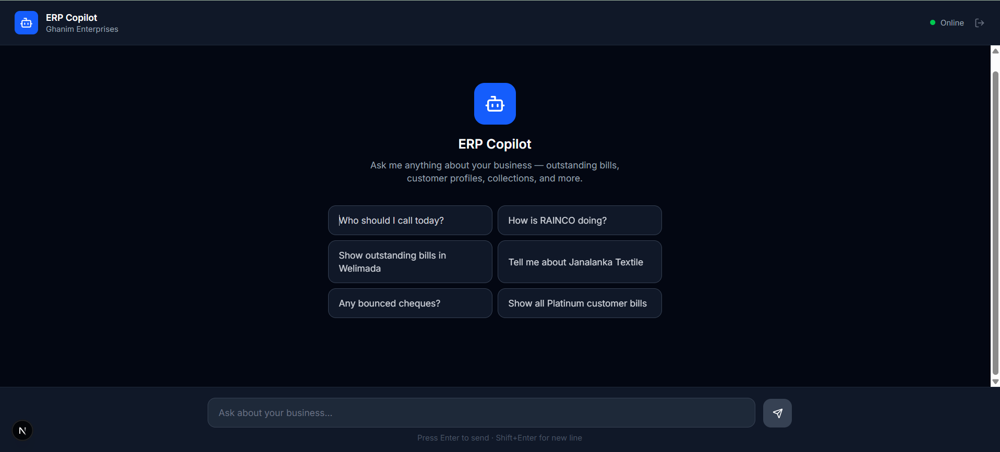
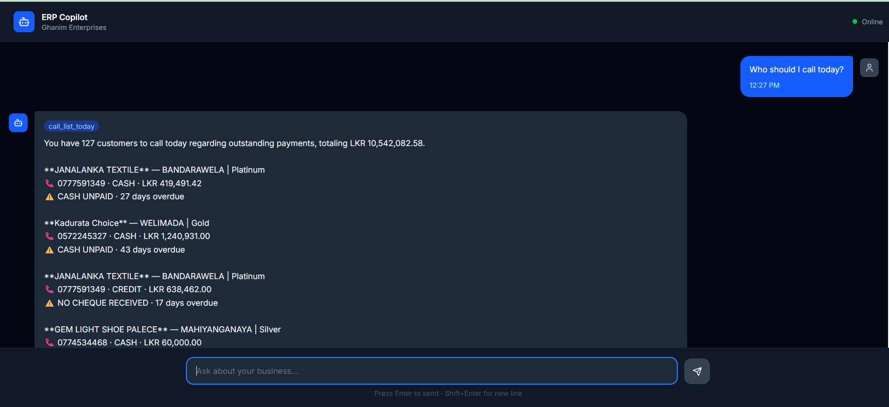
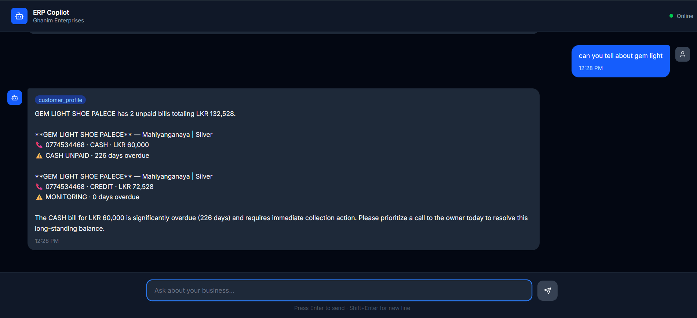

# ERP Copilot

An AI-powered business intelligence assistant for a retail and wholesale business. Instead of navigating reports, staff ask plain English questions and get instant, actionable answers from live ERP data.

---

## Screenshots

### Login


### Dashboard


### AI Response — Call List


### AI Response — Customer Profile


---

## What it does

- **"Who should I call today?"** — prioritized call list based on overdue cash bills, missing cheques, and bounced cheques
- **"How is [business unit] doing?"** — aging report broken into 0–30, 31–60, 61–90, 90+ day buckets
- **"Show outstanding bills in [area]"** — filter by area, business unit, or customer tier
- **"Tell me about [customer]"** — full customer profile: unpaid bills, payment history, reminders
- **"Any bounced cheques?"** — surfaces urgent recovery cases instantly

---

## Architecture

```
Browser
  └── Next.js (Vercel)
        ├── /login         → password-protected entry
        ├── middleware.ts  → httpOnly cookie session guard
        ├── /api/auth      → login / logout API
        └── ChatInterface  → sends questions to AI service

AI Service (FastAPI + LangGraph)
  ├── classify node  → decides which tool to call (Gemini LLM)
  ├── execute node   → calls the right tool with extracted params
  └── respond node   → formats answer as a natural language briefing

Tools
  ├── outstanding_bills  → who owes money, filterable
  ├── aging_report       → debt bucketed by age per business unit
  ├── customer_profile   → full profile for one customer
  └── call_list_today    → prioritized collection call list

Finance API (Spring Boot)
  └── Live ERP database — bills, payments, customers, reminders
```

---

## Tech Stack

| Layer | Technology |
|---|---|
| Frontend | Next.js 16, React 19, Tailwind CSS v4 |
| AI Service | Python, FastAPI, LangGraph, Gemini Flash |
| Finance API | Spring Boot (separate service) |
| Auth | Next.js middleware + httpOnly cookie |
| Hosting | Vercel (frontend) |

---

## Local Setup

**Frontend**
```bash
cd frontend
npm install
# create .env.local with:
# NEXT_PUBLIC_AI_API_URL=http://localhost:8000
# AUTH_PASSWORD=your-password
# AUTH_SECRET=your-random-secret
npm run dev
```

**AI Service**
```bash
cd ai-service
pip install -r requirements.txt
# create .env with GEMINI_API_KEY, FINANCE_API_BASE_URL, COPILOT_USERNAME, COPILOT_PASSWORD
uvicorn main:app --reload
```
